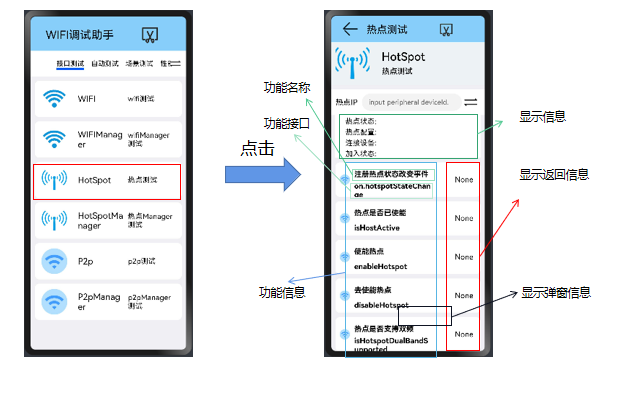
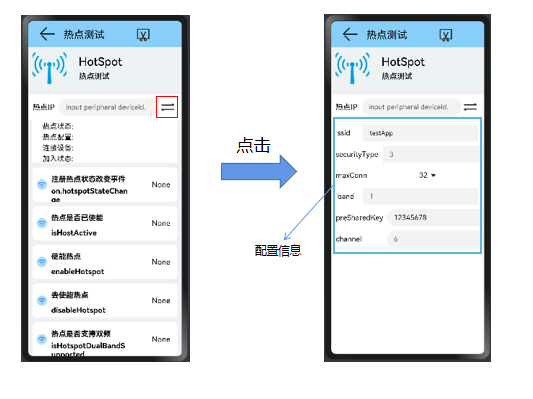

## Hotspot使用说明文档

​		本文档主要介绍了WiFi专项测试程序的Hotspot部分（@ohos.wifi.d.ts）的功能使用说明。

#### 从主界面跳转到Hotspot部分

---

#### setting界面

点击"switch"按钮 ，设置本设备的热点参数配置。

>热点配置信息包括：
>
>- ssid值 （默认值：testApp）   (热点的SSID，编码格式为UTF-8)
>
>- securityType：（默认值：3）  (加密类型)
>
>  >WIFI_SEC_TYPE_INVALID = 0      (/** Invalid security type */)
>  >WIFI_SEC_TYPE_OPEN = 1          (/** Open */) 
>  >WIFI_SEC_TYPE_WEP = 2            (/** Wired Equivalent Privacy (WEP) */)
>  >WIFI_SEC_TYPE_PSK = 3              (/** Pre-shared key (PSK) */)
>  >WIFI_SEC_TYPE_SAE = 4              (/** Simultaneous Authentication of Equals (SAE) */)
>
>- band：（默认值：1）   ( 热点的带宽。1: 2.4G, 2: 5G, 3: 双模频段 )
>
>- preShareKey：(默认值：12345678)    (热点的密钥)
>
>- maxConn：(默认值：32)    (最大设备连接数)
>
>- channel：6
>

#### hotspot（@ohos.wifi.d.ts）的主要接口

|        method名称        |          API名称           |        所需参数         |             返回值              | 备注 |
| :----------------------: | :------------------------: | :---------------------: | :-----------------------------: | :--: |
|         使能热点         |       enableHotspot        |           ()            |             boolean             |      |
|        去使能热点        |       disableHotspot       |           ()            |             boolean             |      |
|     热点是否支持双频     | isHotspotDualBandSupported |           ()            |             boolean             |      |
|      热点是否已使能      |        isHostActive        |           ()            |             boolean             |      |
|     设置热点配置信息     |      setHotspotConfig      | (config: HotspotConfig) |             boolean             |      |
|       热点配置信息       |      getHotspotConfig      |           ()            |          HotspotConfig          |      |
|      获取连接的设备      |        getStations         |           ()            |       Array<StationInfo>        |      |
|   注册热点状态改变事件   |   on.hotspotStateChange    |                         |   callback: Callback<number>    |      |
| 注册热点加入状态改变事件 |     on.hotspotStaJoin      |                         | callback: Callback<StationInfo> |      |
| 注册热点离开状态改变事件 |     on.hotspotStaLeave     |                         | callback: Callback<StationInfo> |      |

#### 功能

**"热点打开"是其他功能测试的前提**

