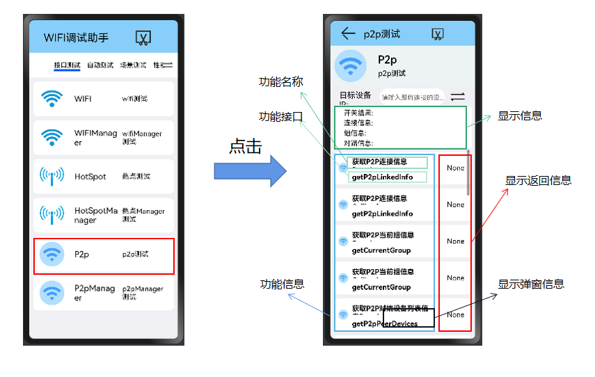

## P2P测试使用说明文档

​		本文档主要介绍WiFi专项测试程序的P2p部分（@ohos.wifi.d.ts）的功能使用说明。

### 从主界面跳转到P2P部分

#### P2P（@ohos.wifi.d.ts）的主要接口

|            method名称            |           API名称           |        所需参数         |                   返回值                   | 备注 |
| :------------------------------: | :-------------------------: | :---------------------: | :----------------------------------------: | :--: |
|     获取P2P连接信息,promise      |  getP2pLinkedInfo(promise)  |           ()            |         Promise<WifiP2pLinkedInfo>         |      |
|     获取P2P连接信息,callback     | getP2pLinkedInfo(callback)  |           ()            | callback: AsyncCallback<WifiP2pLinkedInfo> |      |
|    获取P2P当前组信息,promise     |  getCurrentGroup(promise)   |           ()            |         Promise<WifiP2pGroupInfo>          |      |
|    获取P2P当前组信息,callback    |  getCurrentGroup(callback)  |           ()            | callback: AsyncCallback<WifiP2pGroupInfo>  |      |
| 获取P2P对端设备列表信息,promise  | getP2pPeerDevices(promise)  |           ()            |          Promise<WifiP2pDevice[]>          |      |
| 获取P2P对端设备列表信息,callback | getP2pPeerDevices(callback) |           ()            |  callback: AsyncCallback<WifiP2pDevice[]>  |      |
|             创建群组             |         createGroup         | (config: WifiP2PConfig) |                  boolean                   |      |
|             移除群组             |         removeGroup         |           ()            |                  boolean                   |      |
|           执行P2P连接            |         p2pConnect          | (config: WifiP2PConfig) |                  boolean                   |      |
|           取消P2P连接            |      p2pCancelConnect       |           ()            |                  boolean                   |      |
|           开始发现设备           |    startDiscoverDevices     |           ()            |                  boolean                   |      |
|           停止发现设备           |     stopDiscoverDevices     |           ()            |                  boolean                   |      |
|            删除永久组            |    deletePersistentGroup    |     (netId: number)     |                  boolean                   |      |
|           设置设备名称           |        setDeviceName        |    (devName: string)    |                  boolean                   |      |
|     注册P2P开关状态改变事件      |      on.p2pStateChange      |                         |         callback: Callback<number>         |      |
|     注册P2P连接状态改变事件      |   on.p2pConnectionChange    |                         |   callback: Callback<WifiP2pLinkedInfo>    |      |
|     注册P2P设备状态改变事件      |     on.p2pDeviceChange      |                         |     callback: Callback<WifiP2pDevice>      |      |
|   注册P2P对端设备状态改变事件    |   on.p2pPeerDeviceChange    |                         |    callback: Callback<WifiP2pDevice[]>     |      |
|    注册P2P永久组状态改变事件     | on.p2pPersistentGroupChange |                         |          callback: Callback<void>          |      |
|     注册发现设备状态改变事件     |    on.p2pDiscoveryChange    |                         |         callback: Callback<number>         |      |
|                                  |                             |                         |                                            |      |

#### 测试功能

**"创建群组"是其他功能测试的前提**

