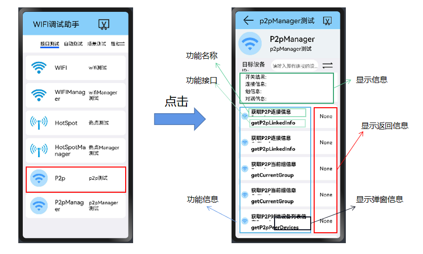

## P2PManager测试使用说明文档

​		本文档主要介绍WiFi专项测试程序的P2pManager部分（@ohos.wifiManager.d.ts）的功能使用说明。

### 从主界面跳转到P2PManager部分

#### P2PManager（@ohos.wifiManager.d.ts）的主要接口

|            method名称            |           API名称           |        所需参数         |                      返回值                      | 备注 |
| :------------------------------: | :-------------------------: | :---------------------: | :----------------------------------------------: | :--: |
|     获取P2P连接信息,promise      |  getP2pLinkedInfo(promise)  |           ()            |            Promise<WifiP2pLinkedInfo>            |      |
|     获取P2P连接信息,callback     | getP2pLinkedInfo(callback)  |           ()            |    callback: AsyncCallback<WifiP2pLinkedInfo>    |      |
|    获取P2P当前组信息,promise     |  getCurrentGroup(promise)   |                         |            Promise<WifiP2pGroupInfo>             |      |
|    获取P2P当前组信息,callback    |  getCurrentGroup(callback)  |                         |    callback: AsyncCallback<WifiP2pGroupInfo>     |      |
| 获取P2P对端设备列表信息,promise  | getP2pPeerDevices(promise)  |                         |             Promise<WifiP2pDevice[]>             |      |
| 获取P2P对端设备列表信息,callback | getP2pPeerDevices(callback) |                         |     callback: AsyncCallback<WifiP2pDevice[]>     |      |
|     获取p2p本地设备，promise     | getP2pLocalDevice(promise)  |                         |              Promise<WifiP2pDevice>              |      |
|    获取p2p本地设备，callback     | getP2pLocalDevice(callback) |                         |      callback: AsyncCallback<WifiP2pDevice>      |      |
|           创建p2p群组            |       createP2pGroup        | (config: WifiP2PConfig) |                       void                       |      |
|             移除群组             |       removeP2pGroup        |           ()            |                       void                       |      |
|           执行P2P连接            |         p2pConnect          | (config: WifiP2PConfig) |                       void                       |      |
|           取消P2P连接            |      p2pCancelConnect       |           ()            |                       void                       |      |
|           开始发现设备           |   startDiscoverP2pDevices   |           ()            |                       void                       |      |
|           停止发现设备           |   stopDiscoverP2pDevices    |           ()            |                       void                       |      |
|            删除永久组            |  deletePersistentP2pGroup   |     (netId: number)     |                       void                       |      |
|    获取创建的所有P2P群组信息     |    getP2pGroups(promise)    |                         |         Promise<Array<WifiP2pGroupInfo>>         |      |
|    获取创建的所有P2P群组信息     |   getP2pGroups(callback)    |                         | callback: AsyncCallback<Array<WifiP2pGroupInfo>> |      |
|           设置设备名称           |      setP2pDeviceName       |    (devName: string)    |                       void                       |      |
|     注册P2P开关状态改变事件      |      on.p2pStateChange      |                         |            callback: Callback<number>            |      |
|     注册P2P连接状态改变事件      |   on.p2pConnectionChange    |                         |      callback: Callback<WifiP2pLinkedInfo>       |      |
|     注册P2P设备状态改变事件      |     on.p2pDeviceChange      |                         |        callback: Callback<WifiP2pDevice>         |      |
|   注册P2P对端设备状态改变事件    |   on.p2pPeerDeviceChange    |                         |       callback: Callback<WifiP2pDevice[]>        |      |
|    注册P2P永久组状态改变事件     | on.p2pPersistentGroupChange |                         |             callback: Callback<void>             |      |
|     注册发现设备状态改变事件     |    on.p2pDiscoveryChange    |                         |            callback: Callback<number>            |      |

#### P2P测试功能

