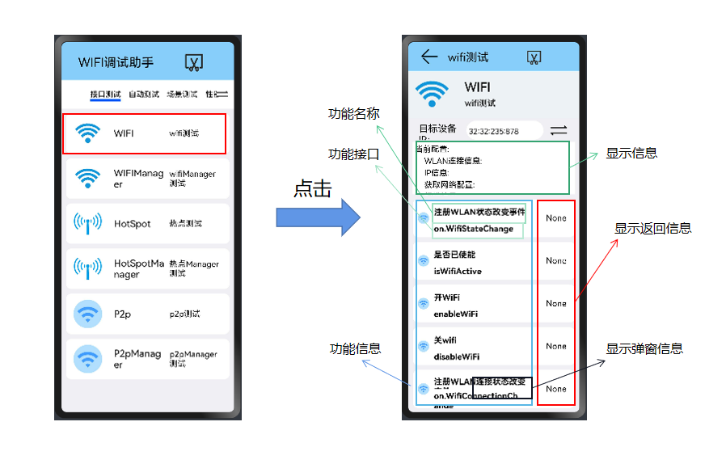
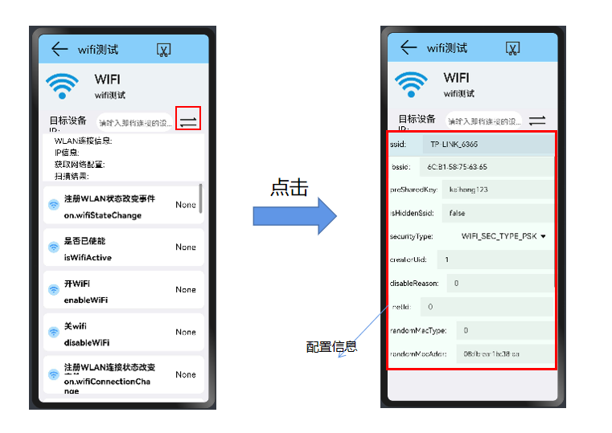

## WiFi使用说明文档

​		本文档主要介绍WiFi专项测试程序的WiFi部分（@ohos.wifi.d.ts）的功能使用说明。

#### 从主界面跳转到WIFI部分

---

#### setting界面

点击"switch"按钮 ，设置本设备的wifi参数配置。

>WiFi配置信息包括：
>
>ssid：（默认值为"TP-LINK_6365"）
>
>bssid：（默认值为"6c:b1:58:75:63:67" ）
>
>preSharedKey:   （默认值为："kaihong123"）
>
>isHiddenSsid:   （默认值为：false）
>
>securityType:   （默认值为：3    表示："WIFI_SEC_TYPE_PSK"）
>
>>0:     'WIFI_SEC_TYPE_INVALID'
>>1:     'WIFI_SEC_TYPE_OPEN'
>>2:     'WIFI_SEC_TYPE_WEP'
>>3:     'WIFI_SEC_TYPE_PSK'
>>4:     'WIFI_SEC_TYPE_SAE'
>
>creatorUid:       (默认值为：1）
>
>disableReason:      (默认值为：0）
>
>netId:           (默认值为：0）
>
>randomMacType:      (默认值为：0）
>
>
>ipType:         (1）
>
>staticIp_ipAddress:      (默认值：3232235880)
>
>staticIp_gateway:       (默认值：3232235777)
>
>staticIp_dnsServers：    (默认值： 3716386629) 
>
>staticIp_domains:        

#### WIFi（@ohos.wifi.d.ts）的主要接口

|          method名称          |             API名称             |           所需参数           |                     返回值                     | 备注 |
| :--------------------------: | :-----------------------------: | :--------------------------: | :--------------------------------------------: | :--: |
|           使能WIFI           |           enableWifi            |              ()              |                    boolean                     |      |
|          去使能WIFI          |           disableWifi           |              ()              |                    boolean                     |      |
|          是否已使能          |          isWifiActive           |              ()              |                    boolean                     |      |
|         启动WLAN扫描         |              scan               |              ()              |                    boolean                     |      |
|     获取扫描信息,promise     |      getScanInfos(promise)      |              ()              |          Promise<Array<WifiScanInfo>>          |      |
|    获取扫描信息,callback     |     getScanInfos(callback)      |              ()              | (callback: AsyncCallback<Array<WifiScanInfo>>) |      |
|     添加网络配置,promise     |    addDeviceConfig(promise)     |  (config: WifiDeviceConfig)  |                Promise<number>                 |      |
|    添加网络配置,callback     |    addDeviceConfig(callback)    |  (config: WifiDeviceConfig)  |       (callback: AsyncCallback<number>)        |      |
| 添加不可信网络配置，promise  |   addUntrustedConfig(promise)   |  (config: WifiDeviceConfig)  |                Promise<boolean>                |      |
| 添加不可信网络配置，callback |  addUntrustedConfig(callback)   |  (config: WifiDeviceConfig)  |       (callback: AsyncCallback<boolean>)       |      |
| 移除不可信网络配置，promise  | removeUntrustedConfig(promise)  |  (config: WifiDeviceConfig)  |                Promise<boolean>                |      |
| 移除不可信网络配置，callback | removeUntrustedConfig(callback) |  (config: WifiDeviceConfig)  |       (callback: AsyncCallback<boolean>)       |      |
|        连接到指定网络        |        connectToNetwork         |     (networkId: number)      |                    boolean                     |      |
|        连接到指定网络        |         connectToDevice         |  (config: WifiDeviceConfig)  |                    boolean                     |      |
|        断开连接的网络        |           disconnect            |              ()              |                    boolean                     |      |
|       查询WLAN信号强度       |         getSignalLevel          | (rssi: number, band: number) |                     number                     |      |
|   获取WLAN连接信息,promise   |     getLinkedInfo(promise)      |              ()              |            Promise<WifiLinkedInfo>             |      |
|  获取WLAN连接信息,callback   |     getLinkedInfo(callback)     |              ()              |   (callback: AsyncCallback<WifiLinkedInfo>)    |      |
|        WLAN是否已连接        |           isConnected           |              ()              |                    boolean                     |      |
|      查询设备支持的特性      |      getSupportedFeatures       |              ()              |                     number                     |      |
|     是否支持相关WLAN特性     |       isFeatureSupported        |     (featureId: number)      |                    boolean                     |      |
|      获取设备的MAC地址       |       getDeviceMacAddress       |              ()              |                    string[]                    |      |
|          获取IP信息          |            getIpInfo            |              ()              |                     IpInfo                     |      |
|        获取国家码信息        |         getCountryCode          |              ()              |                     string                     |      |
|         重新关联网络         |           reassociate           |              ()              |                    boolean                     |      |
|         重新连接网络         |            reConnect            |              ()              |                    boolean                     |      |
|         获取网络配置         |        getDeviceConfigs         |              ()              |            Array<WifiDeviceConfig>             |      |
|         更新网络配置         |          updateNetwork          |  (config: WifiDeviceConfig)  |                     number                     |      |
|        去使能网络配置        |         disableNetwork          |       (netId: number)        |                    boolean                     |      |
|       移除所有网络配置       |        removeAllNetwork         |              ()              |                    boolean                     |      |
|      移除指定的网络配置      |          removeDevice           |         (id: number)         |                    boolean                     |      |
|     注册WLAN状态改变事件     |       on.wifiStateChange        |                              |          (callback: Callback<number>)          |      |
|   注册WLAN连接状态改变事件   |     on.wifiConnectionChange     |                              |          (callback: Callback<number>)          |      |
|     注册扫描状态改变事件     |     on.wifiScanStateChange      |                              |          (callback: Callback<number>)          |      |
|     注册RSSI状态改变事件     |        on.wifiRssiChange        |                              |          (callback: Callback<number>)          |      |
|        注册流改变事件        |         on.streamChange         |                              |          (callback: Callback<number>)          |      |
|                              |                                 |                              |                                                |      |

#### 功能

1. 开/关WiFi（enableWifi/disableWifi）

   **"WiFi打开"是其他功能测试的前提**

   - 使用指导：点击后，在设备上启动/关闭WiFi；根据设备的WiFi情况，显示返回信息。
   - 限制条件：
     - 若WiFi未开，点击"开WiFi"，显示信息为"true"；
     - 若WiFi未开，点击"开WiFi"，发生错误，显示信息为"false"；
     - 若WiFi已打开，点击"开WiFi"，显示信息为"WiFi已经使能"。
     - 若WiFi已打开，点击"关WiFi"，显示结果为"true"；
     - 若WiFi已打开，点击"关WiFi"，发生错误，显示信息为"false"；
     - 若WiFi未打开，点击"关WiFi"，显示结果为"WiFi未使能"。
   - 验证方法：可在设备的设置中查看WiFi的开关情况

2. 获取状态（isWifiActive）

   - 使用指导：点击后，基于WiFi的开关状态，判断WiFi当时的状态。
   - 限制条件：
     - 若本地WiFi打开，返回值为true
     - 若本地WiFi关闭，返回值为false
   - 验证方法：可在设备设置中查看WiFi的当前状态

3. 订阅/取消订阅WiFi状态改变事件（on/off.wifiStateChange）

   - 使用指导：为回调函数，用来监听相关类型事件的变化，并弹窗显示信息。

   - 限制条件：需要在相关类型事件发生改变前，开启监听。
     
     > 注册状态变化：
     >
     > - 订阅WiFi状态更改时报告的事件。
     >
     > - type为要侦听的WiFi状态更改事件的类型。
     >
     >
     > - callback回调用于侦听WiFi状态事件。
     
     - 若本地WiFi已关闭，返回值为0，显示信息为"inactive"；
     - 若本地WiFi已打开，返回值为1，显示信息为"active"；
     - 若本地WiFi正在打开，返回值为2，显示信息为"activating"；
     - 若本地WiFi正在关闭，返回值为3，显示信息为"de-activating"；

   - 验证方法：在事件变化后，查看是否有弹窗信息显示。

4. 扫描（scan）

   - 使用指导：点击后，扫描Wi-Fi热点。
   - 限制条件：
     - 若扫描成功，返回值为true
     - 若扫描失败，返回值为false
   - 验证方法：查看扫描的结果判断是否扫描成功，利用on.wifiScanStateChange()和getScanInfos()查看返回的结果。

5. 获取扫描结果（getScanInfos (Callback/Promise) )
   - 使用指导：返回有关扫描的Wi-Fi热点的信息（如果有的话）
   - 限制条件：扫描
   - 验证方法：查看返回的信息
   
   

