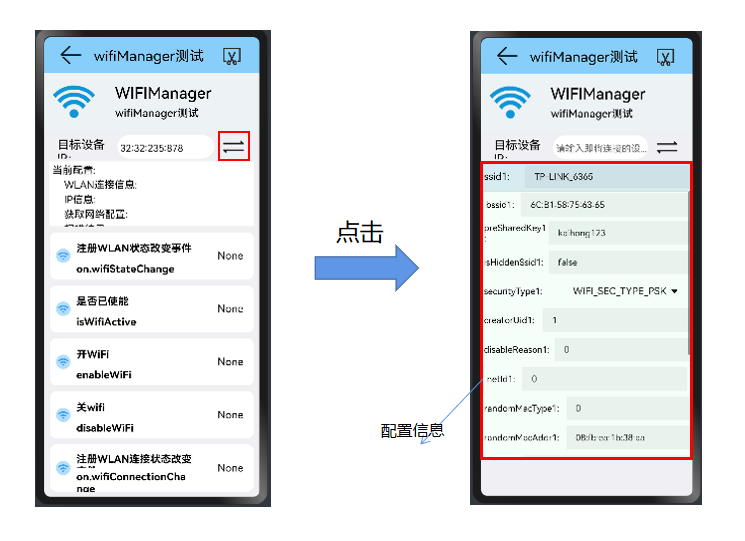

## wifiManager使用说明文档

​		本文档主要介绍WiFi专项测试程序的WiFiManager部分（@ohos.wifiManager.d.ts）的功能使用说明。

#### 从主界面跳转到WIFIManager部分

---

#### setting界面

点击"switch"按钮 ，设置本设备的wifi参数配置。

>WiFi配置信息包括：
>
>ssid：（默认值为"TP-LINK_6365"）
>
>bssid：（默认值为"6c:b1:58:75:63:67" ）
>
>preSharedKey:   （默认值为："kaihong123"）
>
>isHiddenSsid:   （默认值为：false）
>
>securityType:   （默认值为：3    表示："WIFI_SEC_TYPE_PSK"）
>
>>0:     'WIFI_SEC_TYPE_INVALID'
>>1:     'WIFI_SEC_TYPE_OPEN'
>>2:     'WIFI_SEC_TYPE_WEP'
>>3:     'WIFI_SEC_TYPE_PSK'
>>4:     'WIFI_SEC_TYPE_SAE'
>
>creatorUid:       (默认值为：1）
>
>disableReason:      (默认值为：0）
>
>netId:           (默认值为：0）
>
>randomMacType:      (默认值为：0）
>
>
>ipType:         (1）
>
>staticIp_ipAddress:      (默认值：3232235880)
>
>staticIp_gateway:       (默认值：3232235777)
>
>staticIp_dnsServers：    (默认值： 3716386629) 
>
>staticIp_domains:     

#### wifiManager（@ohos.wifiManager.d.ts）的主要接口

|        method名称         |             API名称             |           所需参数           |                  返回值                   | 备注 |
| :-----------------------: | :-----------------------------: | :--------------------------: | :---------------------------------------: | :--: |
|         使能WIFI          |           enableWifi            |              ()              |                   void                    |      |
|        去使能WIFI         |           disableWifi           |              ()              |                   void                    |      |
|        是否已使能         |          isWifiActive           |              ()              |                  boolean                  |      |
|       启动WLAN扫描        |              scan               |              ()              |                   void                    |      |
|       获取扫描信息        |         getScanInfoList         |              ()              |            Array<WifiScanInfo>            |      |
|   添加网络配置,promise    |    addDeviceConfig(promise)     |  (config: WifiDeviceConfig)  |              Promise<number>              |      |
|   添加网络配置,callback   |    addDeviceConfig(callback)    |  (config: WifiDeviceConfig)  |     (callback: AsyncCallback<number>)     |      |
|   添加候选配置,promise    |   addCandidateConfig(promise)   | （config: WifiDeviceConfig） |              Promise<number>              |      |
|   添加候选配置,callback   |  addCandidateConfig(callback)   | (config: WifiDeviceConfig）  |      callback: AsyncCallback<number>      |      |
|   移除候选配置，promise   | removeCandidateConfig(promise)  |     (networkId: number)      |               Promise<void>               |      |
|  移除候选配置，callback   | removeCandidateConfig(callback) |     (networkId: number）     |       callback: AsyncCallback<void>       |      |
|       获取候选配置        |       getCandidateConfigs       |             （）             |          Array<WifiDeviceConfig>          |      |
|      连接到候选配置       |    connectToCandidateConfig     |     (networkId: number)      |                   void                    |      |
|      连接到指定网络       |        connectToNetwork         |     (networkId: number)      |                   void                    |      |
|      连接到指定网络       |         connectToDevice         |  (config: WifiDeviceConfig)  |                   void                    |      |
|      断开连接的网络       |           disconnect            |              ()              |                   void                    |      |
|     查询WLAN信号强度      |         getSignalLevel          | (rssi: number, band: number) |                  number                   |      |
| 获取WLAN连接信息,promise  |     getLinkedInfo(promise)      |              ()              |          Promise<WifiLinkedInfo>          |      |
| 获取WLAN连接信息,callback |     getLinkedInfo(callback)     |              ()              | (callback: AsyncCallback<WifiLinkedInfo>) |      |
|      WLAN是否已连接       |           isConnected           |              ()              |                  boolean                  |      |
|    查询设备支持的特性     |      getSupportedFeatures       |              ()              |                  number                   |      |
|   是否支持相关WLAN特性    |       isFeatureSupported        |     (featureId: number)      |                  boolean                  |      |
|     获取设备的MAC地址     |       getDeviceMacAddress       |              ()              |                 string[]                  |      |
|        获取IP信息         |            getIpInfo            |              ()              |                  IpInfo                   |      |
|      获取国家码信息       |         getCountryCode          |              ()              |                  string                   |      |
|       重新关联网络        |           reassociate           |              ()              |                   void                    |      |
|       重新连接网络        |            reConnect            |              ()              |                   void                    |      |
|       获取网络配置        |        getDeviceConfigs         |              ()              |          Array<WifiDeviceConfig>          |      |
|     更新指定WiFi配置      |       updateDeviceConfig        |  (config: WifiDeviceConfig)  |                  number                   |      |
|     禁用指定设备配置      |       disableDeviceConfig       |     (networkId: number)      |                   void                    |      |
|     移除所有网络配置      |     removeAllDeviceConfigs      |              ()              |                   void                    |      |
|    移除指定的网络配置     |       removeDeviceConfig        |     (networkId: number)      |                   void                    |      |
|   注册WLAN状态改变事件    |       on.wifiStateChange        |                              |       (callback: Callback<number>)        |      |
| 注册WLAN连接状态改变事件  |     on.wifiConnectionChange     |                              |       (callback: Callback<number>)        |      |
|   注册扫描状态改变事件    |     on.wifiScanStateChange      |                              |       (callback: Callback<number>)        |      |
|   注册RSSI状态改变事件    |        on.wifiRssiChange        |                              |       (callback: Callback<number>)        |      |
|      注册流改变事件       |         on.streamChange         |                              |       (callback: Callback<number>)        |      |
|   注册设备配置改变事件    |      on.deviceConfigChange      |                              |       (callback: Callback<number>)        |      |

#### 功能

1. 开/关WiFi

   **"WiFi打开"是其他功能测试的前提**

   
   

