## 使用说明文档

​        本文档主要介绍了Wifi专项测试程序的所在仓，如何使用DevEco程序导入该项目，如何预览、编译和烧录该程序以及该程序的功能使用说明。

### 安装使用说明（win环境）

#### 下载代码

1. 下载方式

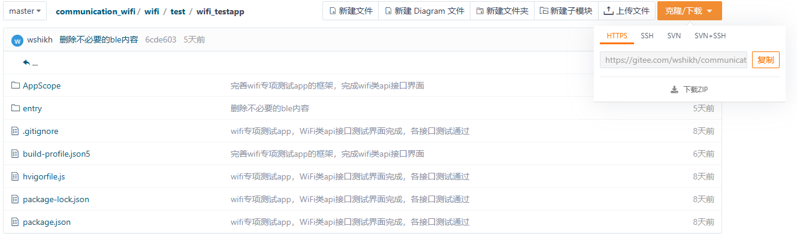

- 使用git下载

  - 安装git。

  - 选择一个空文件夹，右键打开git Bash。（文件夹路径中不要出现中文）

    

  - 使用命令 `git clone {http}`

    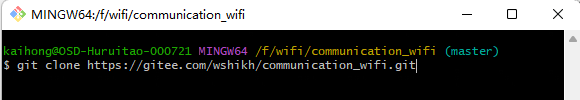

- 直接下载zip

#### 工具

1. DevEco Studio 5.0.0 Release

- DevEco Studio For OpenHarmony是基于IntelliJ IDEA Community开源版本打造，面向OpenHarmony全场景多设备的一站式集成开发环境（IDE），DevEco Studio 5.0.0 Release 配套支持NEXT 版本的应用及服务开发，新提供了引入工程外模块代码支持编码、构建、调试能力、支持构建字节码 har 包、支持 webview 场景调优、支持 ArkTS 内存泄漏自动检测等功能，持续提升应用及服务开发效率。

2. 下载地址: 

   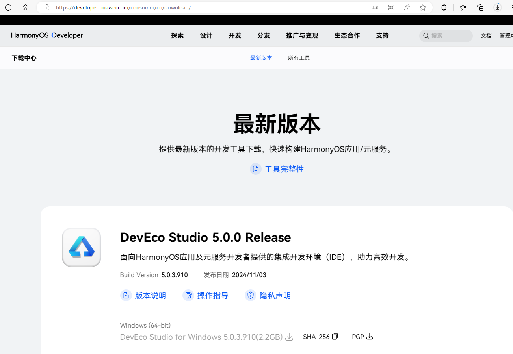

   下载链接：

   https://contentcenter-vali-drcn.dbankcdn.cn/pvt_2/DeveloperAlliance_package_901_9/98/v3/eRJJkdgZRQ69BYGGjC_RwQ/devecostudio-windows-5.0.3.910.zip?HW-CC-KV=V1&HW-CC-Date=20241104T124834Z&HW-CC-Expire=7200&HW-CC-Sign=8DF80D429E54172B7E9BE5C4A029E72F752B897DE5B45D572699B106F20B4A3C

#### 配置full sdk

1. 因为本应用为系统应用；IDE自带的sdk无系统接口；故需要下载配置full-sdk。

2. 每日构建地址：[每日构建 | OpenHarmony CI](http://ci.openharmony.cn/workbench/cicd/dailybuild/dailylist)

3. 在每日构建中选择5.0.0.release版本的full-sdk：ohos-sdk-public-5.0.0-release，对应为api12；或者主干新版本的full-sdk：ohos-sdk-full，对应为api14；下载近期构建成功的全量包。

4. 查看IDE配置的本地sdk路径：

   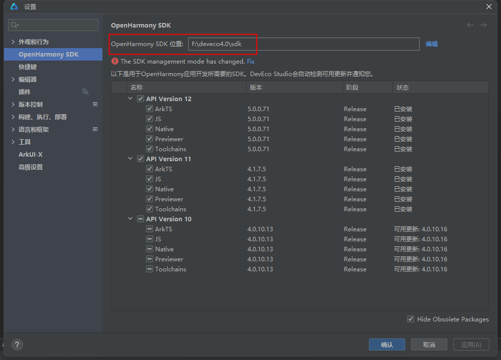

5. 查看下载sdk的版本：将下载好的sdk包解压，取出windows文件夹，点击ets文件夹，打开oh-uni-package.json文件，查看该sdk的版本;如下图所示，即为api12

   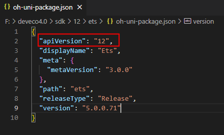

6. 替换本地sdk：改名为对应的api版本：如12，并解压其中的五个文件夹。解压成如下如所示即可。

   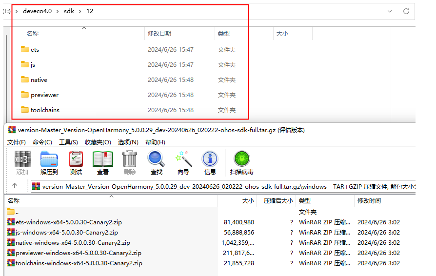

#### 如何导入程序

1. 打开DevEco

2. 在DevEco Studio的欢迎页，选择**Open Project**开始创建一个新工程。

2.选择程序所在的路径

3. 打开程序的homepage

   \communication_bluetooth\test\example\BluetoothTest\entry\src\main\ets\MainAbility\pages\homePage.ets

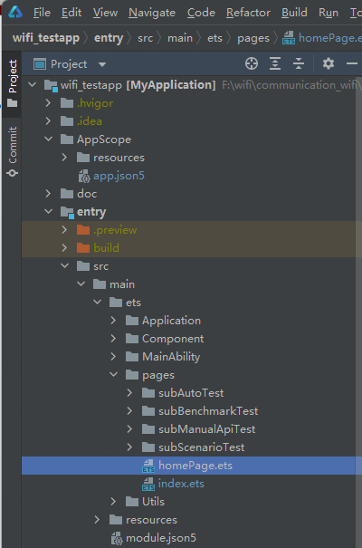

- **entry**为应用的主模块，类似与Android Studio的app模块，一个APP中，对于同一设备类型必须有且只有一个entry类型的HAP，可独立安装运行。

- 使用**previewer**查看程序的预览图

  点击View > Tool Windows > Project > Previewer 如下图所示：

  - 方法一：

  

  - 方法二：

  

  - 成功预览后会生成.preview结构：

  

- 使用**build**编译程序

  - 点击Build > Rebuild 进行编译; Build > Build Hap(s) /App(s) >Build Hap(s) 生成hap文件
  
  

  - hap文件的生成路径：entry\build\outputs\default

    

- 打开homepage点击预览，会显示Wifi专项测试程序的主界面，如下图所示

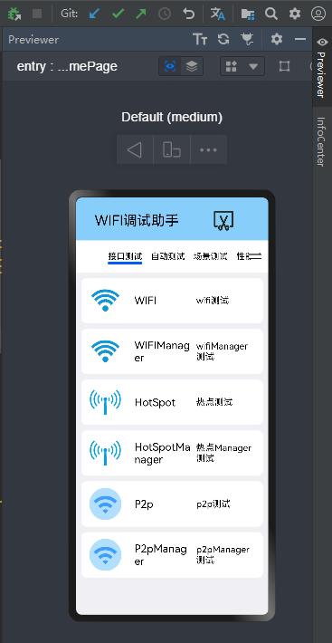

注：在预览中，点击具体的功能模块，能实现页面跳转。具体的方法实现，需要在开发板上完成。

- 将搭载OpenHarmony标准系统的开发板与电脑连接。

- 修改应用权限

- 点击File > Project Structure > Project > Signing Configs界面勾选“Automatically generate signature”，等待自动签名完成即可，点击“OK”。如下图所示：
- 为了保证OpenHarmony应用的完整性和来源可靠，在应用构建时需要对应用进行签名。经过签名的应用才能在真机设备上安装、运行、和调试。如果没有配置签名，会报错：hvigor WARN: Will skip sign ‘hap’,Invalid signingConfig is configured for 'default' product.

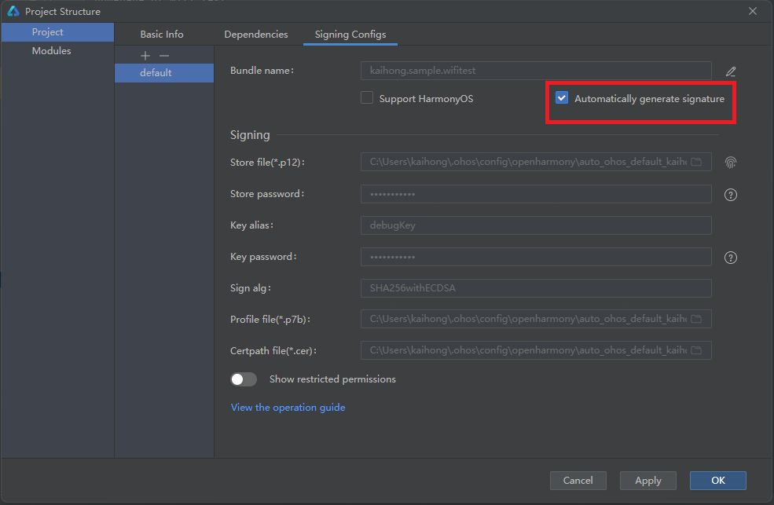

程序烧录

#### 应用权限

在应用的开发过程中，应用的权限、签名信息等需要在HarmonyAppProvision配置文件（该文件在部分文档中也称为profile文件）中声明。

新建一个工程时，应用的类型默认为hos_normal_app（普通应用），APL级别默认为normal。

本应用需要使用系统API，开发者需要手动修改app-feature字段为hos_system_app（系统应用）；apl等级为system_core。

可以参考以下步骤，修改HarmonyAppProvision配置文件。

1. 打开OpenHarmony SDK所在目录

2. 在SDK目录下，进入Toolchains > {Version} > lib文件夹，打开“UnsignedReleasedProfileTemplate.json”文件。

3. 修改对应的字段。

   ~~~
   		"apl":"system_core",
   		"app-feature":"hos_system_app"
   ~~~

完成配置文件修改后，重新进行应用签名。

#### runtimeOS

根据使用的设备，修改build-profile.json5文件对应的runtimeOS

---

### 安装使用说明(Open-Harmony)

在开源鸿蒙系统下

- Wifi专项应用程序路径为：foundation/communication/wifi/wifi/test/wifi_testapp

- 编译命令

  ~~~
  # 全量编译
  ./build.sh --product-name {product_name}
  
  # 单独编译HAP
  ./build.sh --product-name {product_name} --build-target WifiTest

- 生成文件

  - 使用 find out -name "WifiTest.hap*" 查找生成文件，或者直接查看module.json5所写的生成路径。
  - 将生成文件拷到本地电脑上，连接板子，使用命令 `hdc_std.exe install WifiTest`进行安装。
  - 使用命令 `hdc_std uninstall {安装包名}` 进行卸载。
  - 安装包名在 `wifi/test/wifi_testapp/AppScope/app.json5` 如：`"bundleName": "kaihong.sample.wifitest"`

- 补充

  在鸿蒙系统下编译，仍存在高版本对低版本的编译不兼容性问题。即在mater版本下编译的hap无法在beta2版本运行；反之则可以。

---

### 程序说明 

测试类型分为接口测试，自动化测试，场景测试，Profile测试，性能测试，压力测试。

- 接口测试

  >1. WIFI模块测试
  >
  >   WIFI功能界面使用说明文档.md（@ohos.wifi.d.ts）
  >
  >   WIFIManager功能界面使用说明文档.md（@ohos.wifiManager.d.ts）
  >
  >2. Hotspot模块测试
  >
  >   Hotspot功能界面使用说明文档.md（@ohos.wifi.d.ts）
  >
  >   HotspotManager功能界面使用说明文档.md（@ohos.wifiManager.d.ts）
  >
  >3. P2P模块测试
  >
  >   P2P功能界面使用说明文档.md（@ohos.wifi.d.ts）
  >
  >   P2PManager功能界面使用说明文档.md（@ohos.wifiManager.d.ts）
  >
  >接口测试使用说明文档.md

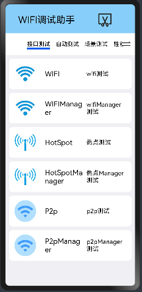

- 自动测试

  >1. WIFI类自动测试
  >
  >   WIFI自动化测试（@ohos.wifi.d.ts）
  >
  >   WIFIManager自动化测试（@ohos.wifiManager.d.ts）
  >
  >2. Hotspot类自动测试
  >
  >   Hotspot自动化测试（@ohos.wifi.d.ts）
  >
  >   HotspotManager自动化测试（@ohos.wifiManager.d.ts）
  >
  >3. P2p类自动测试
  >
  >   P2p自动化测试（@ohos.wifi.d.ts）
  >
  >   P2pManager自动化测试（@ohos.wifiManager.d.ts）
  >
  >自动化测试使用说明文档.md

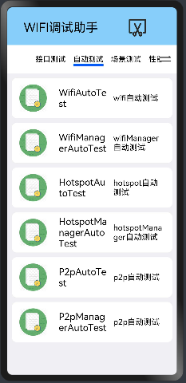

- 场景测试

  >1. WIFI类场景测试
  >
  >   WIFI场景测试（@ohos.wifi.d.ts）
  >
  >   WIFIManager场景测试（@ohos.wifiManager.d.ts）
  >
  >2. Hotspot类场景测试
  >
  >   Hotspot场景测试（@ohos.wifi.d.ts）
  >
  >   HotspotManager场景测试（@ohos.wifiManager.d.ts）
  >
  >3. P2p类场景测试
  >
  >   P2p场景测试（@ohos.wifi.d.ts）
  >
  >   P2pManager场景测试（@ohos.wifiManager.d.ts）
  >
  >场景测试使用说明文档.md

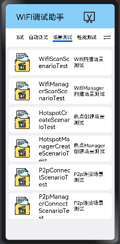

- 性能测试

  >1. WIFI类性能测试
  >
  >   WIFI性能测试（@ohos.wifi.d.ts）
  >
  >   WIFIManager性能测试（@ohos.wifiManager.d.ts）
  >
  >2. Hotspot类性能测试
  >
  >   Hotspot性能测试（@ohos.wifi.d.ts）
  >
  >   HotspotManager性能测试（@ohos.wifiManager.d.ts）
  >
  >3. P2p类性能测试
  >
  >   P2p性能测试（@ohos.wifi.d.ts）
  >
  >   P2pManager性能测试（@ohos.wifiManager.d.ts）
  >
  >性能测试功能界面使用说明文档.md

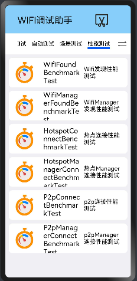

- 压力测试

  >1. WIFI类压力测试
  >
  >  WIFI压力测试（@ohos.wifi.d.ts）
  >
  >  WIFIManager压力测试（@ohos.wifiManager.d.ts）
  >
  >2. Hotspot类压力测试
  >
  >  Hotspot压力测试（@ohos.wifi.d.ts）
  >
  >  HotspotManager压力测试（@ohos.wifiManager.d.ts）
  >
  >3. P2p类压力测试
  >
  >  P2p压力测试（@ohos.wifi.d.ts）
  >
  >  P2pManager压力测试（@ohos.wifiManager.d.ts）
  >
  >压力测试功能界面使用说明文档.md

